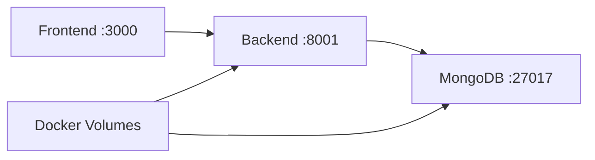

# 🐳 Video Art Masterpiece - Docker Setup Guide

**Eliminate ALL dependency issues with Docker! One-command setup for any system.**

## 🚀 Quick Start (2 Commands)

### Windows:
```cmd
# 1. Run setup
docker-setup.bat

# 2. Open browser
start http://localhost:3000
```

### Linux/Mac:
```bash
# 1. Run setup  
./docker-setup.sh

# 2. Open browser
open http://localhost:3000  # Mac
xdg-open http://localhost:3000  # Linux
```

## 📋 Prerequisites

**Only Docker is required!**

| Platform | Download Link | Version |
|----------|---------------|---------|
| **Windows** | https://www.docker.com/products/docker-desktop | Docker Desktop 4.0+ |
| **Mac** | https://www.docker.com/products/docker-desktop | Docker Desktop 4.0+ |
| **Linux** | https://docs.docker.com/engine/install/ | Docker Engine 20.0+ |

⚠️ **Important**: Ensure Docker Desktop is running before setup!

## 🏗️ Architecture



### Services:
- 🌐 **Frontend**: React app with Nginx (Port 3000)
- 🔧 **Backend**: FastAPI + OpenCV + FFmpeg (Port 8001)  
- 🗄️ **Database**: MongoDB with authentication (Port 27017)
- 📁 **Volumes**: Persistent storage for videos and data

## 📁 Project Structure
```
video-art-masterpiece/
├── 🐳 docker-compose.yml          # Main orchestration
├── 🚀 docker-setup.bat            # Windows setup
├── 🚀 docker-setup.sh             # Linux/Mac setup
├── 📄 Dockerfile.backend          # Python/FastAPI image
├── 📄 Dockerfile.frontend         # React/Nginx image
├── docker/
│   ├── nginx.conf                  # Frontend web server config
│   └── mongo-init.js               # Database initialization
├── backend/
│   ├── .env.docker                 # Docker environment vars
│   └── requirements.txt            # Python dependencies
└── frontend/
    ├── .env.docker                 # React environment vars
    └── package.json                # Node.js dependencies
```

## 🔧 Manual Setup (Alternative)

### Step 1: Install Docker
- **Windows/Mac**: Install Docker Desktop
- **Linux**: Install Docker Engine + Docker Compose

### Step 2: Clone & Setup
```bash
# Navigate to project directory
cd /path/to/video-art-masterpiece

# Build and start all services
docker compose up --build -d
```

### Step 3: Verify Installation
```bash
# Check container status
docker compose ps

# Check logs
docker compose logs -f

# Test endpoints
curl http://localhost:8001/api/health
curl http://localhost:3000/health
```

## 🎯 Usage

1. **Open Application**: http://localhost:3000
2. **Upload Video**: Drag & drop any video file
3. **Choose Art Style**: Select from 6 effects
4. **Process**: Create your masterpiece
5. **Download**: Get high-quality result

## 🛠️ Docker Commands

### Essential Commands:
```bash
# Start services
docker compose up -d

# Stop services  
docker compose down

# View logs
docker compose logs -f

# Restart specific service
docker compose restart backend

# Check status
docker compose ps

# Update and rebuild
docker compose up --build -d
```

### Development Commands:
```bash
# Execute command in container
docker compose exec backend python --version
docker compose exec frontend npm --version

# Access container shell
docker compose exec backend bash
docker compose exec frontend sh

# View database
docker compose exec mongodb mongosh

# Clean restart (removes volumes)
docker compose down -v
docker compose up --build -d
```

## 📊 Monitoring & Debugging

### Health Checks:
- **Backend API**: http://localhost:8001/api/health
- **Frontend**: http://localhost:3000/health
- **All Services**: `docker compose ps`

### Log Monitoring:
```bash
# All services
docker compose logs -f

# Specific service
docker compose logs -f backend
docker compose logs -f frontend
docker compose logs -f mongodb

# Last 50 lines
docker compose logs --tail=50
```

### Resource Usage:
```bash
# Container resource usage
docker stats

# Disk usage
docker system df

# Clean unused resources
docker system prune
```

## 🔐 Security & Configuration

### Environment Variables:
| Service | Variable | Default | Description |
|---------|----------|---------|-------------|
| Backend | `MONGO_URL` | Auto-configured | Database connection |
| Backend | `CORS_ORIGINS` | `localhost:3000` | Allowed origins |
| Frontend | `REACT_APP_BACKEND_URL` | `localhost:8001` | API endpoint |

### Data Persistence:
- **Videos**: `video-art-uploads`, `video-art-outputs`
- **Database**: `video-art-mongodb-data`
- **Gallery**: `video-art-gallery`
- **Temp Files**: `video-art-temp`

### Backup & Restore:
```bash
# Backup volumes
docker run --rm -v video-art-mongodb-data:/data -v $(pwd):/backup alpine tar czf /backup/backup.tar.gz /data

# Restore volumes
docker run --rm -v video-art-mongodb-data:/data -v $(pwd):/backup alpine tar xzf /backup/backup.tar.gz -C /
```

## 🚨 Troubleshooting

### Common Issues:

❌ **"Docker not found"**
```bash
# Install Docker Desktop and ensure it's running
docker --version
```

❌ **"Port already in use"**
```bash
# Kill processes using ports 3000, 8001, 27017
docker compose down
netstat -tulpn | grep :3000
```

❌ **"Container failed to start"**
```bash
# Check logs for specific error
docker compose logs backend
docker compose logs frontend
```

❌ **"Database connection failed"**
```bash
# Restart MongoDB container
docker compose restart mongodb
docker compose logs mongodb
```

❌ **"Video processing fails"**
```bash
# Check backend logs and FFmpeg
docker compose exec backend ffmpeg -version
docker compose logs backend | grep -i error
```

### Performance Issues:
1. **Allocate more memory** to Docker Desktop (8GB+ recommended)
2. **Use SSD storage** for Docker volumes
3. **Close unnecessary applications** during video processing
4. **Monitor resource usage**: `docker stats`

### Clean Reinstall:
```bash
# Complete reset
docker compose down -v
docker system prune -a --volumes
docker compose up --build -d
```

## 🔄 Updates & Maintenance

### Updating the Application:
```bash
# Pull latest changes
git pull

# Rebuild and restart
docker compose down
docker compose up --build -d
```

### Updating Docker Images:
```bash
# Pull latest base images
docker compose pull

# Rebuild with latest
docker compose up --build -d
```

## 🎉 Success Verification

Once setup is complete, you should see:

✅ **3 healthy containers** in `docker compose ps`  
✅ **Frontend** accessible at http://localhost:3000  
✅ **Backend API** responding at http://localhost:8001/api/health  
✅ **MongoDB** running on port 27017  
✅ **Video upload and processing** working end-to-end

## 📞 Support

If you encounter issues:

1. Check **container logs**: `docker compose logs -f`
2. Verify **Docker Desktop** is running and has sufficient resources
3. Ensure **ports 3000, 8001, 27017** are available
4. Try **clean reinstall** if problems persist

---

**🎨 With Docker, Video Art Masterpiece runs identically on any system!** 🚀